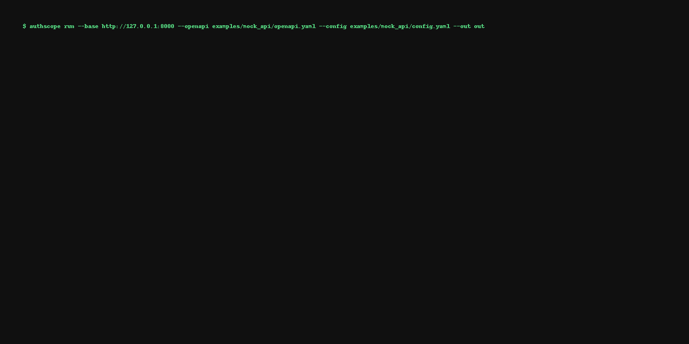

# AuthScope (MVP)

Authorization invariants tester for Web/API — **find BOLA/BFLA** and **auth drift** by comparing what each role/tenant can see **vs. what should be allowed**.

> ⚠️ MVP — safe-by-default (idempotent GETs), simple DSL, OpenAPI-only for now.

---

## Why?
- Systematically test **ownership/tenant isolation** (e.g., `/users/{id}`, `/orgs/{orgId}/orders/{orderId}`).
- Compare **roles/tenants** on the **same request** and flag **unexpected access** (200/OK where rule says it must be denied).
- Run locally or in CI to catch **authorization regressions**.

## Quickstart (Mock demo)

1) Create a virtualenv and install:
```bash
python -m venv .venv && . .venv/bin/activate
pip install -e .
```

2) Run the mock vulnerable API:
```bash
uvicorn examples.mock_api.server:app --reload --port 8000
```

3) In a new shell, run AuthScope on it:
```bash
authscope run   --base http://127.0.0.1:8000   --openapi examples/mock_api/openapi.yaml   --config examples/mock_api/config.yaml   --out out
```

4) See results
- JSON: `out/findings.json`
- HTML: `out/report.html`

You should see a **BOLA** finding for `GET /users/{id}` when Bob can read Alice's profile.

## Real-world usage (crAPI idea)
- Spin up OWASP crAPI via Docker (see their README).
- Export two JWTs for two test users (or use password/login flows).
- Write invariants like:
```yaml
invariants:
  - name: "User can only read own profile"
    when: { method: GET, path: "/identity/api/v2/user/{id}" }
    allow_if: "subject.claims.sub == path.id or 'admin' in subject.claims.roles"
```
- Then run `authscope run` similar to above.

## Config DSL (MVP)

`config.yaml`
```yaml
subjects:
  - name: alice
    token: "alice-token"          # in real targets, put JWT via env or file
    claims: { sub: "u1", roles: ["user"], tenant: "t1" }
  - name: bob
    token: "bob-token"
    claims: { sub: "u2", roles: ["user"], tenant: "t2" }

invariants:
  - name: "Self-only profile read"
    when: { method: GET, path: "/users/{id}" }
    allow_if: "subject.claims.sub == path.id"
  - name: "Tenant isolation"
    when: { method: GET, path: "/orgs/{orgId}/orders/{orderId}" }
    allow_if: "subject.claims.tenant == path.orgId or 'tenant-admin' in subject.claims.roles"
```

## CLI
```
Usage: authscope run --base URL --openapi FILE --config FILE --out DIR [--only-get]
```

## Roadmap
- Seed traffic (HAR/Burp) → id discovery
- Tenancy headers templates (X-Org, X-Tenant)
- Snapshot/compare for CI auth drift
- GraphQL support (selection-set diff + depth/cost)
- SARIF reporter

## License
Apache-2.0 (you can change)


---

## CI & Badges


## HAR Support (MVP)
You can enrich scenarios from a browser/Burp HAR:
```bash
authscope run   --base http://127.0.0.1:8000   --openapi examples/mock_api/openapi.yaml   --config examples/mock_api/config.yaml   --har path/to/traffic.har   --out out
```

## Comparison (high-level)

| Capability | AuthScope | Burp Autorize/AuthMatrix | Schemathesis | Kiterunner / Arjun |
|---|---|---|---|---|
| Model ownership/tenant invariants | ✅ | ⚠️ (manual/per-request) | ❌ | ❌ |
| Cross-subject diff (same req across roles) | ✅ | ⚠️ | ❌ | ❌ |
| OpenAPI-driven scenario gen | ✅ | ❌ | ✅ | ❌ |
| Seed from real traffic (HAR) | ✅ (MVP) | ⚠️ (proxy only) | ❌ | ❌ |
| CI auth drift snapshots | Roadmap | ❌ | ❌ | ❌ |

> ⚠️ means possible with heavy manual effort.


## crAPI Demo (Recommended Showcase)
Use the `examples/crapi` guide to run AuthScope against OWASP crAPI.


